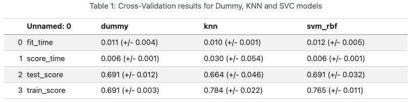
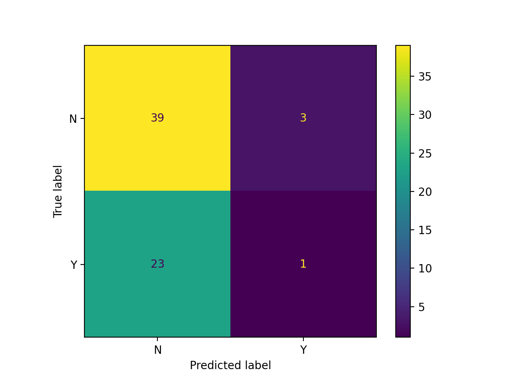

### The value of this group project to me

- **Technical skills**:
    - creating a containerized environment using [Docker](https://www.docker.com/){target="_blank"} to practice a reproducible workflow.
    - applying data cleaning, EDA, machine learning models (baseline, KNN, SVM RBF), and visualization techniques. 

- **Collaboration**: 
    - working with a team of 3 data science students to divide tasks, share insights, and integrate work into a cohesive project.

- **Project management**: 
    - coordinating timelines, version control, and communication to ensure smooth progress.

---

### Overview

This project maps and analyzes public washroom availability in Vancouver parks. It combines spatial data, park metadata, and accessibility attributes to identify coverage gaps and inform planning decisions for park amenities. The analysis was completed as part of **UBC Master of Data Science, DSCI 522 Data Science Workflow course**.

### Project repository

**Forked project repo:** [washrooms-in-vancouver-parks](https://github.com/canadasung/washrooms-in-vancouver-parks){target="_blank"}

---

### Report

The final report can be found here: [Predicting the Presence of Washrooms in Vancouver Parks](https://rsokolsnyder.github.io/washrooms-in-vancouver-parks/reports/washrooms_in_parks.html){target="_blank"}.

---

### Data

#### Source and scope

- **City of Vancouver Parks dataset** (Vancouver 2025) covering 218 parks with facility attributes, locations, and sizes. 

#### Key variables used

- **Target**: washrooms (presence/absence).

- **Predictors**: park size (hectares), neighbourhood, official park flag, advisories, counts of additional facilities, and special features. 

#### Notes and limitations

- The dataset is cross‑sectional and may omit contextual features (visitor counts, funding cycles) that could improve predictive performance. 

---

### Methods & Analytics

#### Exploratory analysis

- Compare distributions of binary amenities and park size between parks with and without washrooms (frequency plots, histograms). 

#### Modeling approach

- **Baseline**: Dummy classifier to set a reference accuracy.

- **Models tested**: K‑Nearest Neighbors (KNN) and Support Vector Machine with RBF kernel (SVM RBF).

- **Validation**: 70/30 train/test split with 5‑fold cross‑validation on training data.

- **Preprocessing**: Standardize numeric features; encode categorical predictors (neighbourhood, flags); handle missingness prior to fitting. 

#### Evaluation metrics

- Cross‑validation test score, training score, and confusion matrix on held‑out test set to assess generalization and class balance. 

---

### Key Findings

- **Parks with washrooms tend to be larger**: median hectare is higher for parks that include washrooms. 

- **Washroom presence correlates with other amenities**: parks offering more facilities are more likely to have washrooms. 

- **SVM RBF outperformed KNN and the baseline**: in cross‑validation, though the improvement over the dummy baseline was modest, indicating limited predictive signal in the chosen features. 

- **KNN showed signs of overfitting**: (higher training score, lower test performance) and therefore generalized poorly. 

- **Implication**: richer features (e.g., visitor counts, park usage, funding/prioritization data) or alternative modeling strategies are likely needed to produce stronger, actionable predictions. 

---

### Visualizations

- Model comparison: {fig-alt="Model Performance" width="100%"}

- Confusion matrix: {fig-alt="Confusion Matrix" width="100%"}