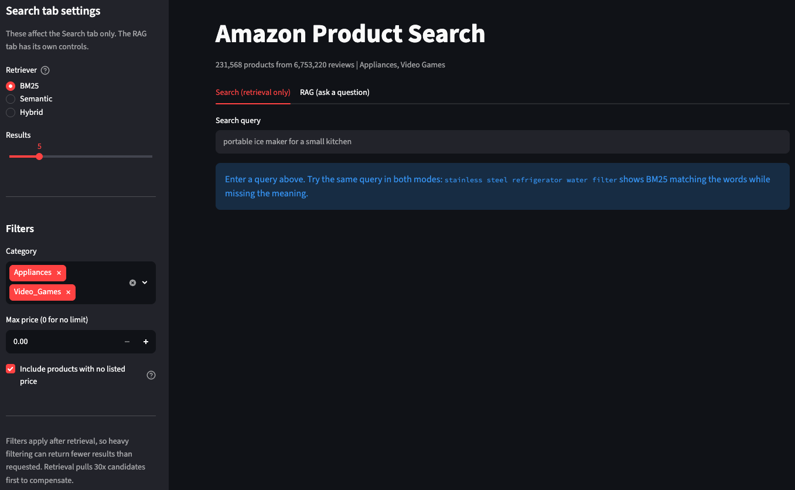
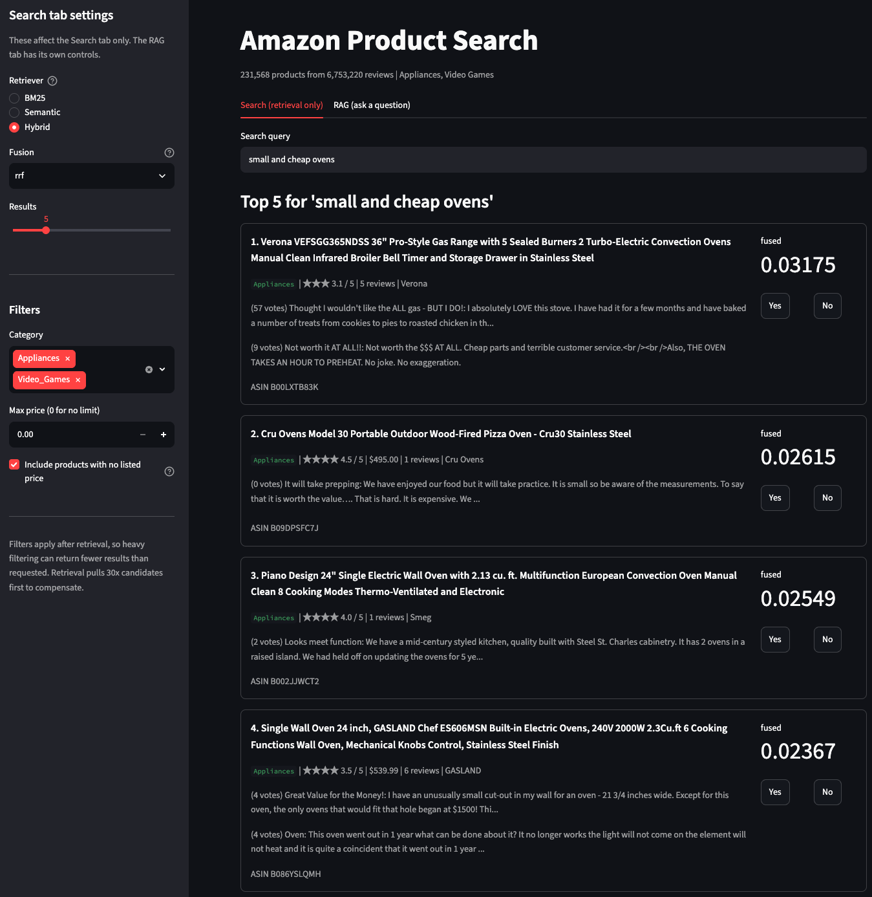
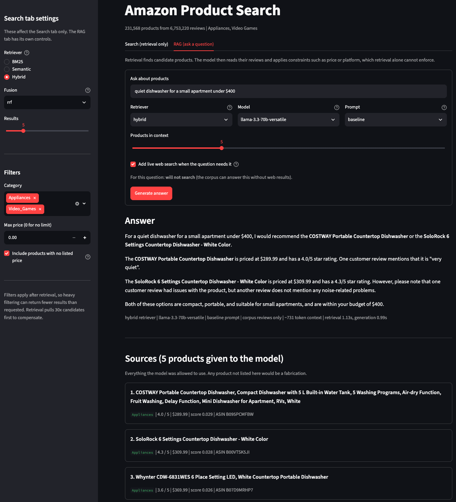

### The value of this project to me

- **Practicing and implementation**:
    - information retrieval algorithm and method: Sparse embedding (BM25), Dense embedding (Semantic Search), Hybrid embedding
    - LLM-based AI Assistant
    - RAG (Retrieval-Augmented Generation)
    - real-time product recommendation system 

- **Measurement and evaluation**:
    - designing a 10-query evaluation set across difficulty tiers, then building a reproducible harness that regenerates every comparison table on demand.
    - quantifying *why* two retrieval methods disagree instead of asserting it: their top-5 results overlap on only 0.2 of 5 products on average.
    - running controlled experiments where one variable moves at a time, including a prompt comparison whose result contradicted my prediction.

- **Data quality investigation**:
    - finding and quantifying three traps in the source data that would each have silently corrupted results, including a metadata field that is wrong for 73% of rows.
    - writing validation that asserts corpus invariants *before* a 25-minute indexing step, which caught two real bugs on its first run.

- **Engineering at scale**:
    - scaling from 94k to 231,568 products, which required streaming ingest, schema-aware caching, and memory profiling.
    - building staleness guards so a search index can never be silently used against a corpus it was not built from.
    - 154 tests, GitHub Actions CI, and root-causing a segfault from a macOS crash report.

- **Building LLM systems responsibly**:
    - gating scope on a measured retrieval threshold in code, so off-topic questions are refused before any API call is made.
    - redacting contact details reviewers volunteered into review text, stripping them in the context builder so the model never receives them.
    - auditing the corpus for prompt injection, then declining to build the filter it seemed to call for, because all 40 matches were false positives.

- **Independent follow-through**:
    - taking a graded team project and rebuilding it alone, deliberately, to understand each decision.

---

### Overview

A context-aware product search assistant for Amazon listings. Given a natural language query, it retrieves relevant products and generates an answer grounded in what reviewers actually wrote, showing the exact sources used.

This began as a two-person project for **UBC MDS DSCI 575 (Advanced Machine Learning)**, built with teammate Harrison Li. After the course ended I rebuilt it from scratch, expanding the corpus 2.5x and adding the engineering the original lacked. The goal was to understand every decision well enough to defend it with a measurement.

Almost every figure below is something I measured on the real corpus.

### Project repository

**GitHub:** [smart-amazon-product-query-assistant](https://github.com/canadasung/smart-amazon-product-query-assistant){target="_blank"}

---

### What I learned, with evidence

Each item links to the full writeup in the repository.

#### Preprocessing can silently destroy a query before any model sees it

The query `quiet dishwasher for a small apartment under $400` returned a **400 CFM range hood**. Tracing it:

```
'quiet dishwasher for a small apartment under $400'
   -> ['quiet', 'dishwasher', 'small', 'apartment', '400']
   dropped: ['for', 'a', 'under']
```

`under` is a stopword and `$` is not alphanumeric, so BM25 searched for the bare number `400` with no notion of "less than". The constraint was deleted during tokenization, before ranking began. Semantic search lost the same constraint differently, dissolving it into a 384-dimensional vector where no dimension means "price ceiling".

The lesson generalized: when a result looks wrong, inspect what the pipeline actually received before suspecting the algorithm.

[Full trace through all four retrieval modes](https://github.com/canadasung/smart-amazon-product-query-assistant/blob/main/docs/query-walkthrough.md){target="_blank"}

#### Three data traps, each found by measuring the data

| Trap | Measured | Consequence if missed |
|---|---|---|
| `price` is null | **50.5%** of products | Formatted naively it renders as the string `nan`, which BM25 then indexes as an ordinary searchable word across half the corpus |
| `main_category` is unreliable | only **27.1%** of products in the Appliances file are labelled "Appliances" | Category filtering would be wrong for 73% of rows |
| `average_rating` is not the review mean | differs by >0.1 for **62,960 of 94,319** products | It is Amazon's site-wide figure; a document can show "4.4 stars" above reviews averaging 2.88 |

The `nan` trap was the subtle one. It survives tokenizer cleaning, because `nan` looks exactly like a real word, so it had to be fixed at document construction instead.

[Dataset reference with all measurements](https://github.com/canadasung/smart-amazon-product-query-assistant/blob/main/docs/amazon-reviews-2023.md){target="_blank"}

#### Two retrieval methods that barely agree, quantified

Across the 10-query evaluation set, BM25 and semantic search shared **0.2 of their top 5 results on average**. On most queries the overlap was zero.

That single number is the empirical case for hybrid retrieval: the methods are not better and worse versions of each other, they are complementary. It also reframed several results, because low overlap does not mean one system is wrong. On `something two people can play together on the couch` the two returned entirely different games and **both answer sets were correct**.

[Per-query retrieval comparison](https://github.com/canadasung/smart-amazon-product-query-assistant/blob/main/results/milestone1_retrieval_comparison.md){target="_blank"}

#### An experiment whose result contradicted my prediction

I compared three prompt variants on identical retrieved context: a lightly-steered control, one with explicit anti-hallucination rules, and one that constrained only the *output shape*.

I expected the explicit rules to handle constraints best. The shape-constrained variant was strictest: it alone rejected a $39.99 game as not "under 40 dollars". Forcing a NOT RECOMMENDED section appears to make the model adjudicate every candidate rather than mention only the easy ones.

[Prompt comparison and RAG evaluation](https://github.com/canadasung/smart-amazon-product-query-assistant/blob/main/results/milestone2_discussion.md){target="_blank"}

#### Model scale improves grounding while fluency stays flat

Running an 8B and a 70B model on byte-identical context, both wrote fluent English. The 8B **fabricated two prices**: it claimed a $370 dishwasher was "above the $400 budget", and that a $19.99 game was over a $40 budget when the real disqualifier was its platform. Both statements contradicted the context in its own prompt.

The usual RAG failure is a confident wrong fact. That drove two design decisions: the app shows a sources panel so any claim is checkable, and the context builder writes missing values explicitly as `price not listed`, because a model shown a gap will fill it.

[Model comparison on identical context](https://github.com/canadasung/smart-amazon-product-query-assistant/blob/main/results/final_model_comparison.md){target="_blank"}

#### Scaling the corpus was an engineering problem

Going from 94k to 231,568 products broke naive approaches. What it actually required:

- **Streaming ingest.** DuckDB reads 1.16 GB of gzipped JSONL at roughly 400 MB peak memory; loading it into pandas first would not fit comfortably.
- **Schema-aware cache invalidation.** Checking that a cached file has the right column *types* as well as the right names. A `price` column silently written as a string broke numeric filtering while every column name stayed correct.
- **Corpus fingerprinting.** Each index stores `categories@n_products#doc_text_sha` and refuses to load on a mismatch. The content hash catches an edit to document construction, which leaves the category list and product count identical. It costs 1.5 seconds against the 25 minutes it protects.
- **Memory profiling.** The BM25 index alone occupies 4.1 GB, which turned out to be the constraint that shapes any deployment plan.

[Fourteen design decisions with the measurement behind each](https://github.com/canadasung/smart-amazon-product-query-assistant/blob/main/docs/design-decisions.md){target="_blank"}

#### Deciding where a guardrail belongs

The app answered "what's 1+1?". Retrieval had returned five arbitrary appliances, because top-k retrieval always returns k results however poor the match, so the emptiness check never fired and the model answered from its own knowledge.

The obvious fix is a prompt rule telling the model to decline. That rule takes effect only **after the API call is billed**, so I put the gate in Python: a threshold on the top-1 cosine, checked before retrieval runs.

Choosing the threshold took a measurement. Off-topic queries scored 0.31 to 0.376; the weakest *legitimate* query in my evaluation set scored 0.437. A threshold of 0.40 sits between them and classified 11 of 11 queries correctly. The margin is only 0.061, which is the honest caveat: vague-but-real questions and off-topic ones genuinely look alike to an embedding model, so I set the threshold low.

One subtlety made this harder than it looked. The score has to come from the semantic retriever directly, because **neither fusion method preserves absolute scale**: Reciprocal Rank Fusion emits `1/(60 + rank)`, so its top score is `1/61` whether a match is perfect or worthless, and weighted fusion min-max normalizes the top result to `1.0` by construction. Gating on a fused score would have let everything through while looking correct. A test now hands the gate a fused score of 1.0 alongside a cosine of 0.30 and asserts refusal, so a future simplification cannot quietly reintroduce the bug.

The same reasoning settled a privacy question. Reviewers had typed their own email addresses and phone numbers into review text: 282 and 112 documents respectively. A prompt rule saying "never repeat contact details" asks the model to hold the data and decline to use it. Stripping it in the context builder means the model never receives it, which is the stronger guarantee.

#### Knowing which defence *not* to build

Auditing the same corpus for prompt injection, 40 documents matched instruction-shaped phrases. Reading them, all 40 were ordinary English: "you are now a 4th grader", "you are now a dryer technician", and `system prompt` meaning a shell prompt. Zero were attacks.

That number argues against the defence it seems to invite. A regex filter shipped against this corpus would have run at a **100% false-positive rate**, silently degrading 40 legitimate products while catching nothing, and any paraphrase defeats it anyway.

Capability is what bounds injection risk. The model here has no tools, takes no actions, and its output renders as plain text, so the worst an injected review achieves is a bad recommendation. Writing that down changed how I think about agent design generally: the question worth asking is "what can this thing do if the rule fails".

[Prompt injection, and what RAG creates](https://github.com/canadasung/smart-amazon-product-query-assistant/blob/main/docs/rag-concepts.md){target="_blank"}

---

### Dataset

- **Source**: [Amazon Reviews 2023](https://huggingface.co/datasets/McAuley-Lab/Amazon-Reviews-2023){target="_blank"} (McAuley Lab, UCSD)
- **Scale**: **231,568 products** from **6,753,220 reviews**, spanning Appliances (94,319) and Video Games (137,249)
- **Configurable**: any of the dataset's 34 categories can be selected at build time. Per-category intermediates are cached, so adding one re-downloads only that category.

---

### Architecture

```
query -> (scope gate) -> retrieve -> build context -> fill prompt -> generate -> answer + sources
```

Four modes share one interface, so switching is a single argument:

| Mode | Method |
|---|---|
| **BM25** | Keyword matching with IDF, term-frequency saturation, and length normalization |
| **Semantic** | `all-MiniLM-L6-v2` embeddings, L2-normalized in a FAISS `IndexFlatIP` so inner product equals cosine similarity |
| **Hybrid** | Reciprocal Rank Fusion, `1/(60 + rank)`, or weighted score normalization |
| **RAG** | Hybrid retrieval, then an LLM reads the reviews and applies constraints retrieval cannot enforce |

Because all three retrievers return `(parent_asin, score)`, the RAG pipeline is retriever-agnostic: semantic RAG and hybrid RAG differ by one argument and share the same pipeline.

**Models**: `llama-3.3-70b-versatile` (primary) and `openai/gpt-oss-20b` (comparison), both via Groq, plus a local `llama3.1:8b` through Ollama for iterating without consuming API quota.

**Context is trimmed before it reaches the model.** Whole documents produce 4,000 to 6,000 token contexts; title, metadata, and two truncated reviews produce about 600. An 85% reduction with no loss of answer quality, which moved the free-tier budget from roughly 22 to over 80 calls per day.

[How RAG works](https://github.com/canadasung/smart-amazon-product-query-assistant/blob/main/docs/rag-concepts.md){target="_blank"} and [how the retrievers work](https://github.com/canadasung/smart-amazon-product-query-assistant/blob/main/docs/retrieval-concepts.md){target="_blank"}, both written as learning notes.

---

### Evaluation

Evaluation runs as a script. `python src/evaluate.py` regenerates every comparison table, so changing a prompt or a retriever and re-running produces updated results automatically.

One deliberate choice: the qualitative rating columns are **left blank** by the generator. A model grading its own output is not an evaluation, so the script produces the evidence and I supply the verdicts. Each answer is printed alongside the exact sources the model was given, which makes the check concrete: a product named in an answer but absent from its sources is a fabrication.

---

### Engineering practice

- **154 tests**, running in under 4 seconds with no network and no data files. They target the things that fail *silently*: tokenization, document construction, corpus invariants, fusion arithmetic, the staleness guards, and the safety gates.
- **GitHub Actions CI** running lint, format check, tests, and a check that every documented CLI still parses. The suite needs no secrets, which is why the workflow stays simple.
- **Reproducibility treated as a real goal.** The pipeline rebuilds from nothing with three commands, and tests pass on a machine with no NLTK corpus downloaded, verified by simulating one.
- **Ruff** for lint and formatting, pinned via `pyproject.toml` so results do not depend on whichever version happens to be on `PATH`.

---

### App

A Streamlit app with two tabs. **Search** returns ranked products with category and price filters. **RAG** answers a question and displays the answer above the exact sources it was given.

#### Search tab

{fig-alt="Streamlit search tab showing five ranked oven products with fused scores, ratings, prices, and review snippets" width="100%"}

#### RAG tab

The answer sits above the exact products the model was given. The caption records the retriever, model, prompt, context size, and stage timings, so any answer can be traced back to how it was produced.

{fig-alt="Streamlit RAG tab showing a generated recommendation citing prices and a review quote, above the source products" width="100%"}

The line under the web-search checkbox reports the gate's decision before generating, here *"will not search (the corpus can answer this without web results)"*.

Generation is gated behind an explicit submit button. Streamlit re-runs every tab's body on every interaction, so an ungated LLM call would fire on any widget change and exhaust the daily API quota within minutes.

An optional web-search tool (Tavily) covers what a fixed 2023 snapshot cannot: current prices and availability. It is gated so it runs only when the question needs it, and results appear in a separate labelled block so web claims stay distinguishable from review evidence.

---

### Installation

```bash
git clone https://github.com/canadasung/smart-amazon-product-query-assistant.git
cd smart-amazon-product-query-assistant

conda env create -f environment.yml
conda activate smart-amazon-query-assist

python src/download_data.py     # download, merge, build documents
python src/bm25.py              # keyword index
python src/semantic.py          # FAISS index

streamlit run app/app.py
```

Retrieval needs no API keys. The RAG features need a Groq key in `.env`; `.env.example` documents every variable.

---

### Key takeaways

- **Measure before asserting.** Nearly every design decision here is defensible because a number backs it: the 0.2/5 retrieval overlap, the 50.5% null prices, the 85% context reduction, the 4.1 GB index. Each one changed what I built.
- **The most expensive bugs are the silent ones.** A `nan` in half the corpus, a price column typed as a string, a stale index serving confident wrong answers. None of them raised an error. That is why the project has validation, staleness guards, and tests aimed at exactly those paths.
- **Be willing to be wrong in public.** The prompt experiment contradicted my prediction, and saying so made the writeup more useful.
- **Verification has to match the failure mode.** Checking that a server returns HTTP 200 does not prove a query works. I learned that from a segfault my own testing had missed.
- **Put the guarantee where it cannot be argued with.** Leaving data out of the context is stronger than asking a model not to repeat it. The same reasoning moved scope checking into a threshold in code, where it also stops costing API quota.
