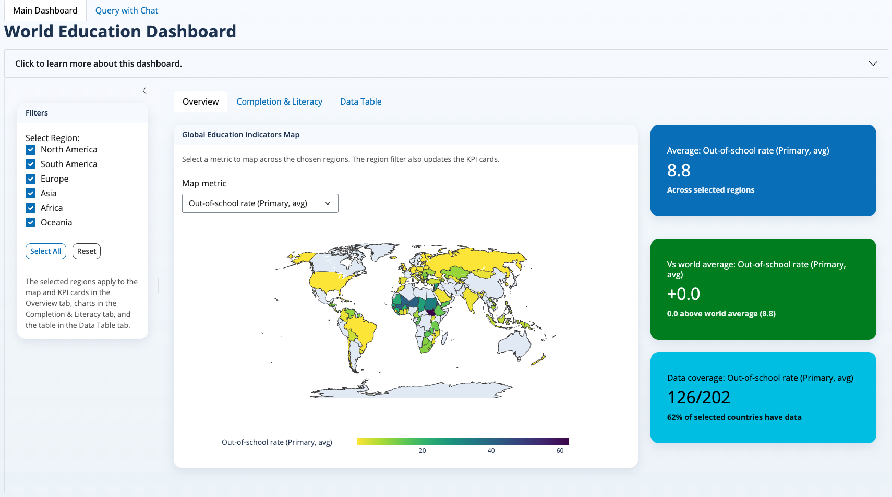
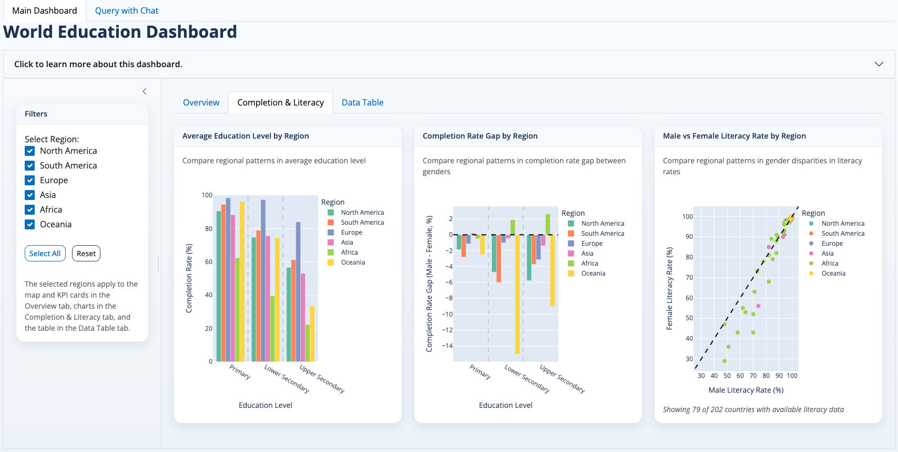
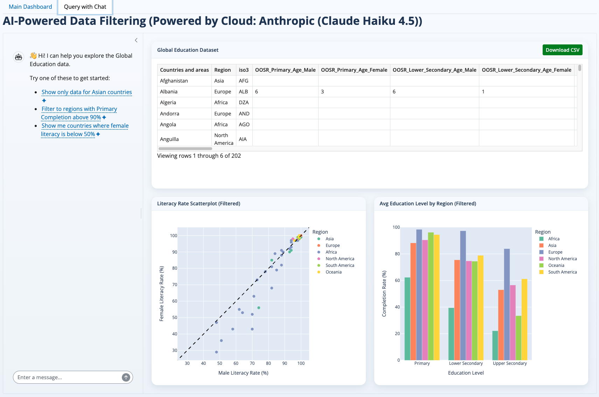

### The value of this group project to me

- **Technical skills**:
    - deploying a Shiny dashboard to share insights interactively on [Posit Cloud](https://posit.cloud/){target="_blank"}, a great substitute if Tableau or Power BI are not available.
    - applying data cleaning, EDA, visualization, and dashboarding techniques. 

- **Collaboration**: 
    - working with a team of 4 data science students to divide tasks, share insights, and integrate work into a cohesive project.

- **Project management**: 
    - coordinating timelines, version control, and communication to ensure smooth progress.

---

### Overview

This project analyzes global education indicators to explore patterns in enrollment, attainment, and inequality across countries. The analysis was completed as part of **UBC Master of Data Science, DSCI 532 Data Visualization course** and demonstrates data cleaning, exploratory analysis, visualization, and basic modeling to surface insights relevant to education gaps between genders and international regions. Then finally, deploy the insights in an interactive dashboard built with Shiny, and a chatbot interface using a large language model to query the data.

### Project repository

**Forked project repo:** [World Education Project](https://github.com/canadasung/DSCI-532_2026_15_WorldEducation){target="_blank"}

---

### Data

**Primary files (from the repo)**

- **`data/processed/processed_global_education.csv`**: cleaned, merged dataset used for analysis.  
- **`data/raw/Global_Education.csv`**: raw source files sourced from [Kaggle - World Educational Data](https://www.kaggle.com/datasets/nelgiriyewithana/world-educational-data/data), compiled from UNESCO Institute for Statistics, UNICEF, and UN Statistics Division.
- **`notebooks/EDA.ipynb`**: analysis jupyter notebooks (Python) used to produce figures and tables.

---

### Methods & Analytics

- **Data cleaning & integration**: harmonized country codes, handled missingness, merged multiple sources.  
- **Exploratory data analysis**: summary statistics, distributions, and correlation matrices.
- **Segmentation**: country clustering by region, gender, education outcomes and socioeconomic indicators.
- **Visualization**: maps, comparative bar charts, correlation scatter plot.
- **Chatbot using LLM**: used a large language model to automatically filter and explore the data.

---

### Dashboard

We built an interactive dashboard using [Shiny app](https://shiny.posit.co/){target="_blank"} to allow users to explore the data and insights dynamically. The dashboard includes: World map views with metric selector, bar charts comparing average education level by region, and completion rate gap by region, scatter plot comparing male and female literacy rate by region, and a chatbot interface for querying the data using natural language.

- Landing page {fig-alt="Map View" width="100%"}

- Interactive plots {fig-alt="Plot View" width="100%"}

- Chatbot page {fig-alt="Chatbot Interface" width="100%"}